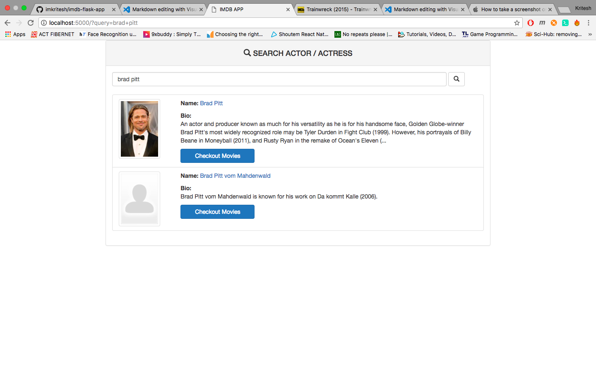
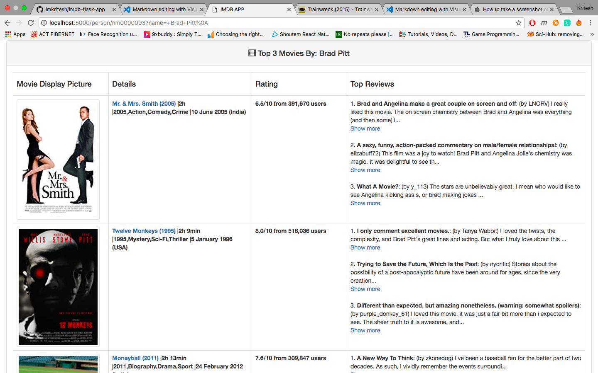

# imdb-flask-app

A flask web-app in which user searches actor/actress by name and the application performs a search on IMDb, scrapes top 3 movies of the actor/actress, each with the top 3 user reviews (most helpful) of the movie and lists the results in tabular format.

# Screenshots
- Index Page

- Result Page

